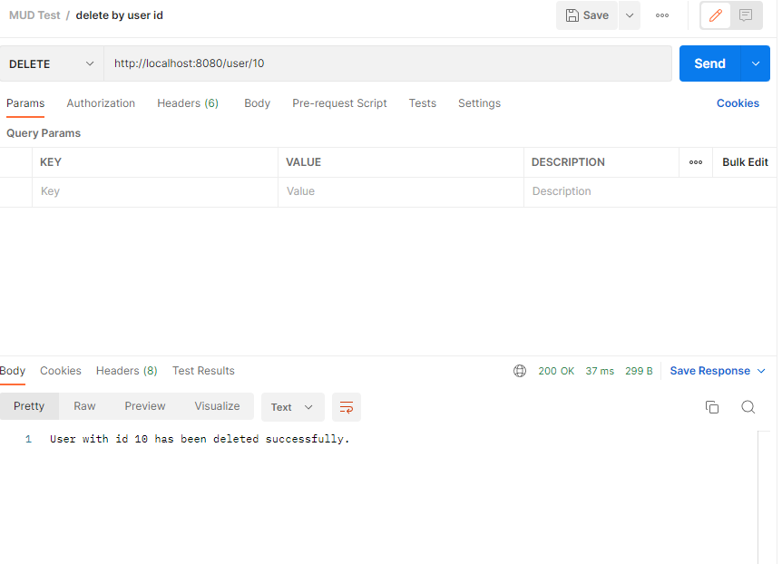

# Getting Started

### Reference Documentation
For further reference, please consider the following sections:

* [Official Apache Maven documentation](https://maven.apache.org/guides/index.html)
* [Spring Boot Maven Plugin Reference Guide](https://docs.spring.io/spring-boot/docs/2.7.8/maven-plugin/reference/html/)
* [Create an OCI image](https://docs.spring.io/spring-boot/docs/2.7.8/maven-plugin/reference/html/#build-image)
* [Spring Web](https://docs.spring.io/spring-boot/docs/2.7.8/reference/htmlsingle/#web)
* [Spring Data JPA](https://docs.spring.io/spring-boot/docs/2.7.8/reference/htmlsingle/#data.sql.jpa-and-spring-data)

### Guides
The following guides illustrate how to use some features concretely:

* [Building a RESTful Web Service](https://spring.io/guides/gs/rest-service/)
* [Serving Web Content with Spring MVC](https://spring.io/guides/gs/serving-web-content/)
* [Building REST services with Spring](https://spring.io/guides/tutorials/rest/)
* [Accessing Data with JPA](https://spring.io/guides/gs/accessing-data-jpa/)

### Extra Information

## Post Man
* [Download Postman app for testing](https://www.postman.com/downloads/)
* [PostgreSQL is the DBM that I used, download here](https://www.postgresql.org/)
* Helped a lot with figuring out how to send requests
* FYI: 8080 is the default port for that spring boot uses
## PostgreSQL
* [PostgreSQL is the DBM that I used, download here](https://www.postgresql.org/)
* Follow the installation instructions

* Add psql to environment variables in order to run on windows powershell
  * a. Open the Start menu and search for "Environment Variables".
  * b. Click on "Edit the system environment variables".
  * c. Click on the "Environment Variables" button.
  * d. Under "System Variables", find the "Path" variable and click on "Edit".
  * e. Click on "New" and enter the path to the PostgreSQL bin directory. By default, this is "C:\Program Files\PostgreSQL{version}\bin".
  * f. Click "OK" to save the changes.

* Run windows powershell
  * login with the command 'psql -U username -d dbname' where username and database are the names you netered during installation
  * once logged in, copypaste the following code to create the table

CREATE TABLE USERS (
ID serial PRIMARY KEY,
username char(50),
name char(50),
email char(50)
);

* This should create the table that the back end uses.
* edit the application.properties file under resources to be able to connect to your database

### Example requests for postman

